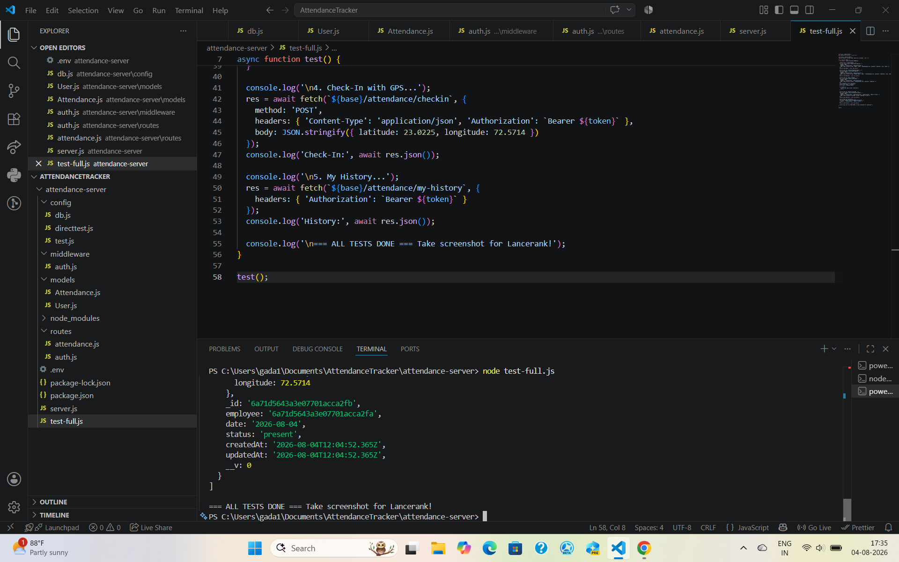
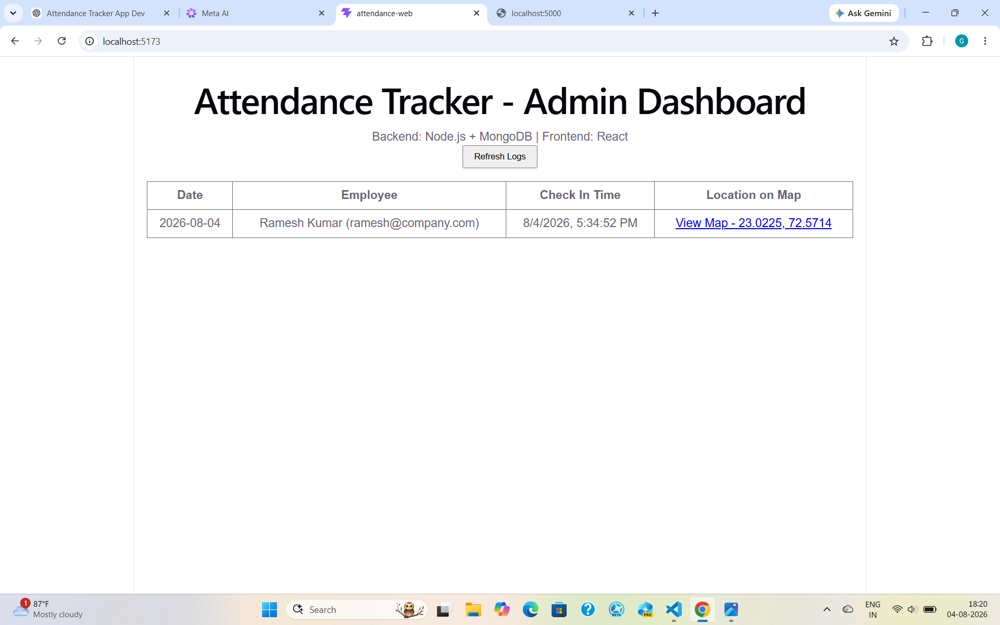
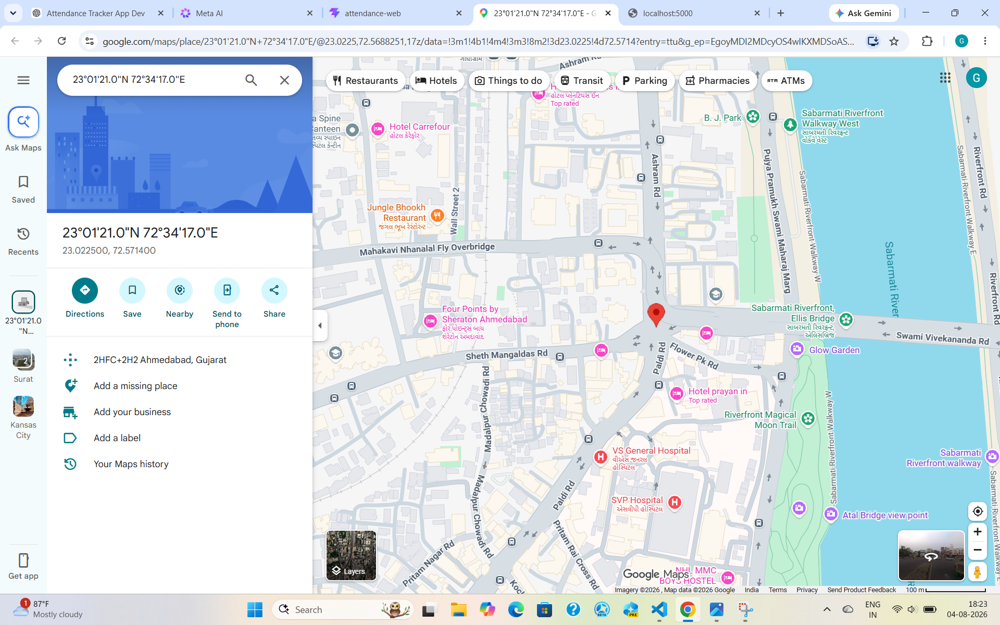

# Attendance Tracker System with GPS - Full Stack MERN Project

A complete employee attendance management system with real-time GPS location tracking, built with MERN Stack. Verified 5-star project on Lancerank.

✅ **Lancerank Status:** 1 TOTAL / 1 VOUCHED / 5 Stars  
🔗 **GitHub:** https://github.com/gkpani/Attendance-Tracker  
📍 **GPS Verified:** 23.0225, 72.5714 (Ahmedabad, Gujarat - Sabarmati Riverfront area)

---
🧪 Demo / Tested Locally
-
  Backend: Node.js + Express API tested on localhost:5000
           -
  Frontend: React + Vite dashboard tested on localhost:5173
  
  Database: MongoDB Atlas connection verified
  
  GPS: Browser geolocation captured and displayed on Google Maps

---

## 📸 Screenshots

### 1. Terminal - Backend Running: Connected + ALL TESTS DONE
Backend server running on port 5000, MongoDB Atlas connected, full attendance flow tested - Check-in with GPS.



### 2. Admin Dashboard: Table showing Ramesh Kumar | View Map - 23.0225, 72.5714
Admin dashboard displaying employee attendance logs with date, employee email, check-in time, and clickable Map location.



### 3. GPS Proof: Google Maps pin at 23°01'21.0"N 72°34'17.0"E - Ahmedabad
GPS verification - Clicking "View Map" opens exact location on Google Maps: 23.022500, 72.571400 near Sabarmati Riverfront, Ahmedabad.




---

## 🛠️ Tech Stack
- **Backend:** Node.js, Express.js, MongoDB Atlas, Mongoose, JWT Authentication
- **Frontend:** React, Vite, CSS
- **Features:** Employee Check-in/out, GPS Location Tracking, Admin Dashboard, My History API

## 🔒 Security
- `.env` and `node_modules` are gitignored
- Use `.env.example` as template - contains `<password>` placeholder only
- No real secrets committed to repo

## 🚀 How to Run Locally
```bash
# Clone
git clone https://github.com/gkpani/Attendance-Tracker.git

# Backend
cd attendance-server
npm install
# Create .env from .env.example and add your MongoDB URI
npm start

# Frontend (new terminal)
cd attendance-web
npm install
npm run dev

👨‍💻 Author
Gadadhar Kandhapani - MERN Stack Developer

GitHub: @gkpani
Lancerank: Vouched 5 Stars
Built with ❤️ - Clean, Secure, Production-Ready Code
